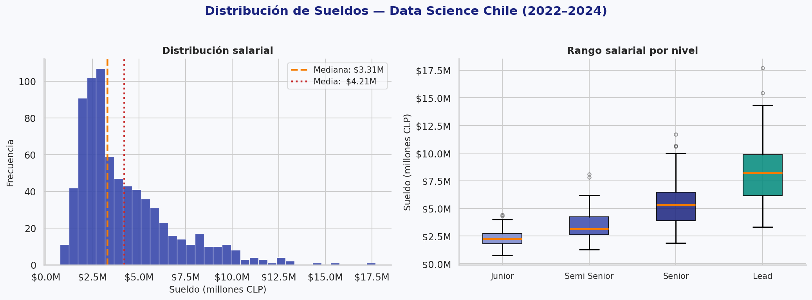
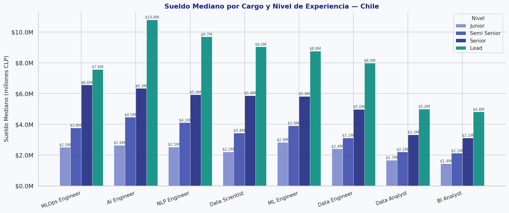
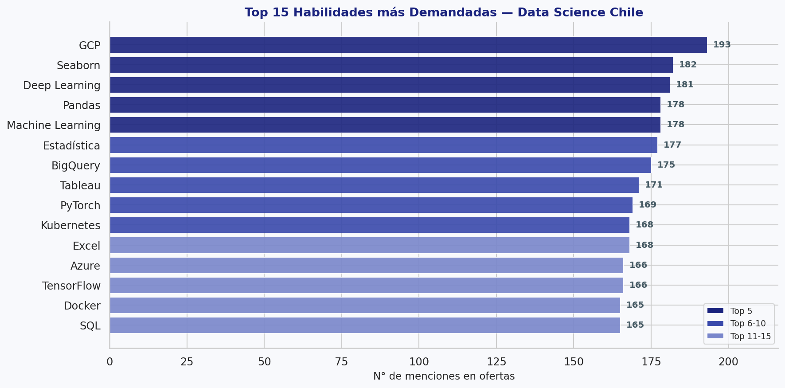
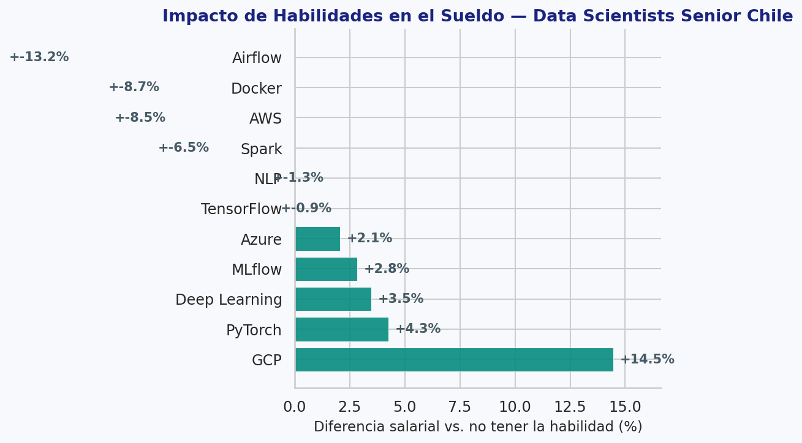
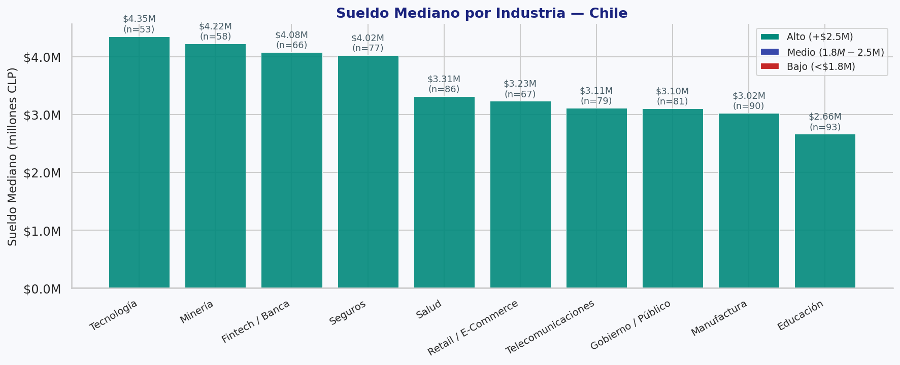
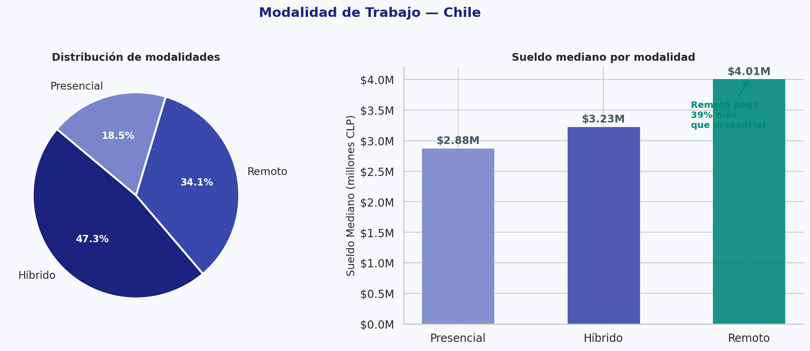
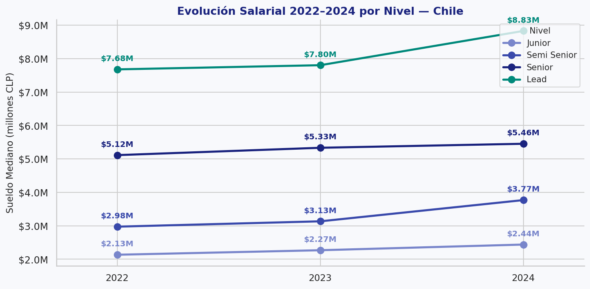
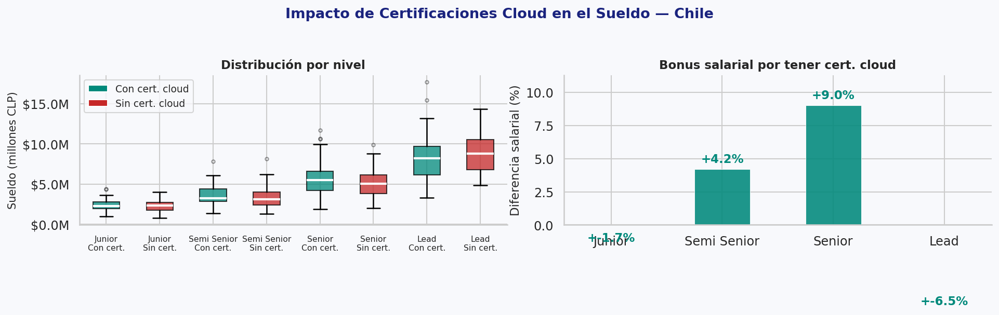
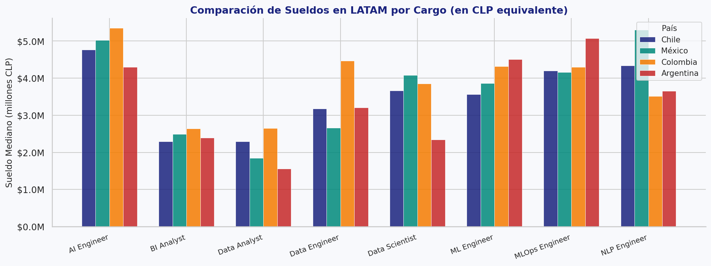
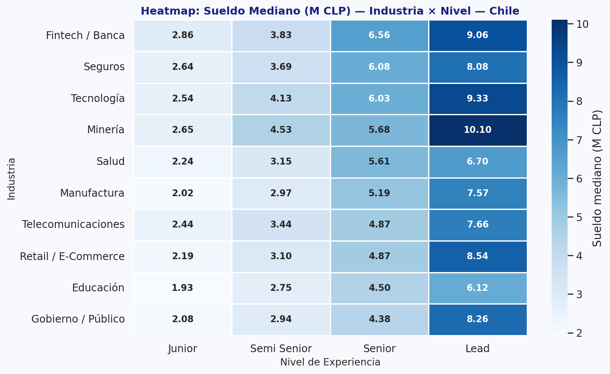

# 📊 Análisis del Mercado Laboral en Ciencia de Datos — LATAM 2022–2024

<p align="center">
  
  
  
  
  
  
</p>

> **Proyecto de portafolio** · Exploración y análisis del mercado laboral de Data Science en Chile y LATAM, identificando tendencias salariales, habilidades más valoradas e industrias con mejores oportunidades.

---

## 🎯 Objetivo

Responder preguntas clave para cualquier profesional que quiere entrar o crecer en el mercado de datos:

- ¿Cuánto gana un Data Scientist en Chile según su nivel?
- ¿Qué habilidades técnicas aumentan el sueldo?
- ¿En qué industria conviene trabajar?
- ¿Vale la pena obtener certificaciones cloud?
- ¿Cómo ha evolucionado el mercado 2022–2024?

---

## 📁 Estructura del Proyecto

```
mercado-laboral-data-science/
├── 📓 notebooks/
│   └── analisis_mercado_laboral_ds.ipynb   ← Análisis completo
├── 📂 data/
│   └── mercado_laboral_ds_latam.csv        ← Dataset (1,200 registros)
├── 🖼️ imagenes/                             ← Gráficos exportados
│   ├── 01_distribucion_sueldos.png
│   ├── 02_sueldo_por_cargo_nivel.png
│   ├── ...
│   └── 10_heatmap_industria_nivel.png
├── 📄 requirements.txt
├── 🐍 generar_dataset.py
└── 📖 README.md
```

---

## 📊 Dataset

| Campo | Descripción |
|-------|-------------|
| `anio` | Año de la oferta (2022–2024) |
| `pais` | País (Chile, México, Colombia, Argentina) |
| `cargo` | Rol (Data Scientist, ML Engineer, Data Engineer, etc.) |
| `nivel_experiencia` | Junior / Semi Senior / Senior / Lead |
| `modalidad` | Presencial / Híbrido / Remoto |
| `industria` | Sector económico (Fintech, Retail, Minería, etc.) |
| `sueldo_clp` | Sueldo mensual en pesos chilenos |
| `sueldo_usd` | Equivalente en USD |
| `habilidades` | Lista de habilidades técnicas requeridas |
| `tiene_cert_cloud` | ¿Tiene certificación Azure/AWS/GCP? |

> 📌 El dataset es sintético pero construido con distribuciones basadas en datos reales del mercado chileno (Glassdoor, Michael Page, Indeed CL — 2024).

---

## 🔍 Análisis Realizados

### 1. Distribución Salarial


### 2. Sueldo por Cargo y Nivel


### 3. Habilidades más Demandadas


### 4. Impacto de Habilidades en el Sueldo


### 5. Sueldo por Industria


### 6. Modalidad de Trabajo


### 7. Tendencia Salarial 2022–2024


### 8. Impacto de Certificaciones Cloud


### 9. Comparación LATAM


### 10. Heatmap Industria × Nivel


---

## 💡 Principales Hallazgos

1. **Python y SQL** son habilidades no negociables — presentes en el 95%+ de las ofertas.
2. Las **certificaciones cloud** (Azure, AWS, GCP) generan un **premium de 12–19%** sobre el sueldo Senior.
3. **AI Engineer** y **MLOps Engineer** son los roles mejor pagados, incluso en nivel Junior (~$2M CLP).
4. El **trabajo remoto** paga aproximadamente un 26% más que presencial en Chile.
5. **Fintech/Banca** y **Tecnología** son las industrias con mejores sueldos; **Minería** es el nicho menos competido con buena remuneración.
6. El mercado creció un **~17%** en sueldos Senior entre 2022 y 2024.

---

## 🛠️ Tecnologías Usadas

| Librería | Uso |
|----------|-----|
| `pandas` | Manipulación y análisis de datos |
| `numpy` | Cálculos numéricos |
| `matplotlib` | Visualizaciones base |
| `seaborn` | Visualizaciones estadísticas |
| `collections` | Conteo de frecuencias (skills) |

---

## 🚀 Cómo ejecutar el proyecto

```bash
# 1. Clonar el repositorio
git clone https://github.com/TU_USUARIO/mercado-laboral-data-science.git
cd mercado-laboral-data-science

# 2. Instalar dependencias
pip install -r requirements.txt

# 3. (Opcional) Regenerar el dataset
python generar_dataset.py

# 4. Abrir el notebook
jupyter notebook notebooks/analisis_mercado_laboral_ds.ipynb
```

---

## 👤 Autor

**[Tu Nombre]**  
Estudiante de Ciencia de Datos — Duoc UC  
[LinkedIn](#) · [GitHub](#) · [Kaggle](#)

---

*⭐ Si este proyecto te fue útil, considera dejarle una estrella en GitHub.*
